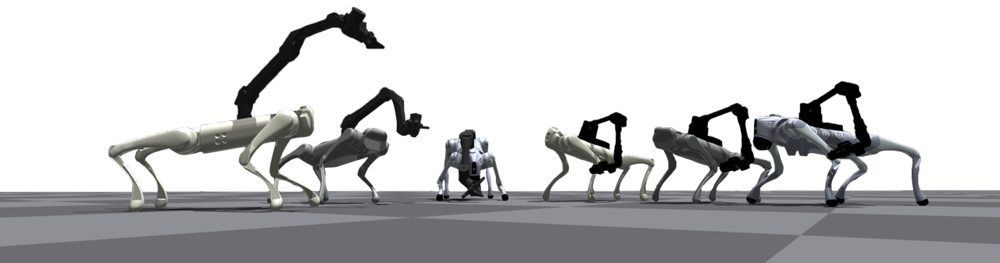
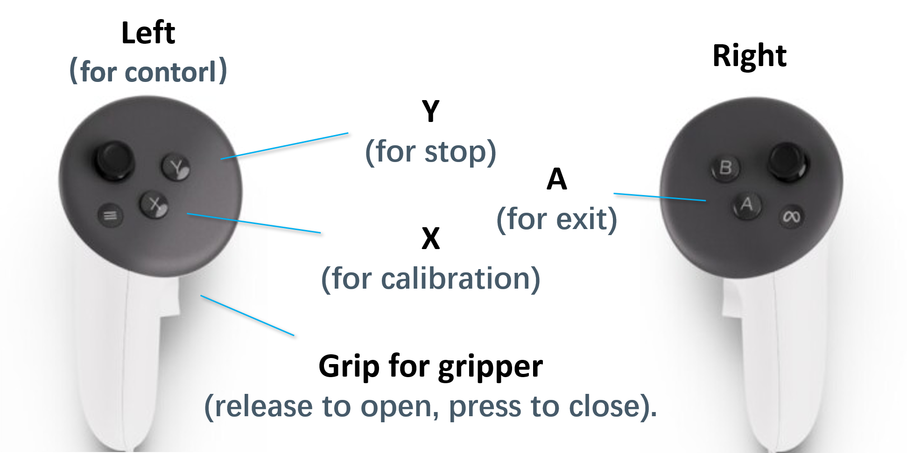

# RoboDuet: Learning a Cooperative Policy for Whole-body Legged Loco-Manipulation


<h3> <a href="https://github.com/locomanip-duet/locomanip-duet.github.io/blob/master/RoboDuet.pdf">📝 Paper</a> | <a href="https://locomanip-duet.github.io/"> 🖼️ Project Page</a></h3>

This repo is an official PyTorch implementation of our paper *<b>"RoboDuet: Learning a Cooperative Policy for Whole-body Legged Loco-Manipulation}"</b>*. Thanks to the cooperative policy mechanism and two-stage training strategy, the proposed framework demonstrates agile whole-body control and zero-shot transfer deployment capabilities. <b>📺️More demo details can be found on our project page.</b>


</br>

## Installation
### Conda Environment
```bash
conda create -n roboduet python=3.8  # python=3.8 is necessary for Isaac Gym
conda activate roboduet
```

</br>

### Install Isaac Gym
1. Download and install Isaac Gym Preview 4 from https://developer.nvidia.com/isaac-gym
2. unzip the file via:
    ```bash
    tar -xf IsaacGym_Preview_4_Package.tar.gz
    ```

3. now install the python package
    ```bash
    cd isaacgym/python && pip install -e .
    ```
4. Verify the installation by try running an example

    ```bash
    python examples/1080_balls_of_solitude.py
    ```
5. For troubleshooting check docs `isaacgym/docs/index.html`

</br>

### Install this repo
```bash
git clone https://github.com/locomanip-duet/RoboDuet.git
ch RoboDuet
pip install -r requirements.txt
pip install -e .
```

</br>

## Usage
### Train
```bash
python scripts/auto_train.py --num_envs 4096 --run_name test_roboduet --sim_device cuda:0 --robot go1  # or --robot go2 
```
you can also use "--headless" to run the simulation without GUI
```bash
python scripts/auto_train.py --num_envs 4096 --run_name test_roboduet --sim_device cuda:0 --robot go1 --headless
```
</br>

### Play
#### **⌨️Keypoard Control**
When
we use keyboard to control the robot, the key mapping is as follows:
<table>
  <tr>
    <td>
      <table>
        <tr><th>Key</th><th>Action</th></tr>
        <tr><td>NUMPAD 8</td><td>Move Forward</td></tr>
        <tr><td>NUMPAD 5</td><td>Move Backward</td></tr>
        <tr><td>NUMPAD 4</td><td>Move Left</td></tr>
        <tr><td>NUMPAD 6</td><td>Move Right</td></tr>
        <tr><td>NUMPAD 7</td><td>Turn Left</td></tr>
        <tr><td>NUMPAD 9</td><td>Turn Right</td></tr>
      </table>
    </td>
    <td>
      <table>
        <tr><td>U</td><td>Arm Up</td></tr>
        <tr><td>O</td><td>Arm Down</td></tr>
        <tr><td>I</td><td>Arm Forward</td></tr>
        <tr><td>K</td><td>Arm Backward</td></tr>
        <tr><td>J</td><td>Arm Left</td></tr>
        <tr><td>L</td><td>Arm Right</td></tr>
      </table>
    </td>
    <td>
      <table>
        <tr><td>W</td><td>Arm Pitch Down</td></tr>
        <tr><td>S</td><td>Arm Pitch Up</td></tr>
        <tr><td>A</td><td>Arm Roll Left</td></tr>
        <tr><td>D</td><td>Arm Roll Right</td></tr>
        <tr><td>Q</td><td>Arm Yaw Left</td></tr>
        <tr><td>E</td><td>Arm Yaw Right</td></tr>
        <tr><td>R</td><td>Reset</td></tr>
      </table>
    </td>
  </tr>
</table>

```bash
# example:
python scripts/play_by_key.py --logdir runs/test_roboduet/2024-10-13/auto_train/003436.678552_seed9145 --ckptid 40000 --sim_device cuda:0 
```

</br>

#### **VR Control**

1. Streaming Meta Quest 3 with [ALVR](https://github.com/alvr-org/ALVR) and [SteamVR](https://store.steampowered.com/steamvr). We mainly use the left handle to control. The key mapping is as follows:

<div align="center">
    
</div>

<br>

2. Move `scripts\vr_play\vr_streaming.py` into your pc for streaming.
<br>

3. modify the `ip + port` in the `vr_streaming.py` and `remote_pub.py`.
    ```bash
    # NOTE This is the ip and port of the pc host connected to vr
    GLOBAL_IP = "192.168.12.198"
    GLOBAL_PORT = "34565"
    ```
<br>

3. Run
    ```bash
    # PC
    python scripts/vr_play/vr_streaming.py

    # Training Machine
    ## screen 1
    python scripts/vr_play/play_by_remote.py --logdir runs/test_roboduet/2024-10-13/auto_train/003436.678552_seed9145 --ckptid 40000 --sim_device cuda:0 

    ## screen 2
    python scripts/vr_play/remote_pub.py
    ```

Enjoy your journey with the legged robot! 🎉️

</br>


# [Deployments](https://github.com/locomanip-duet/RoboDuet_Deployment)
We will provide deployment code for both the [Unitree Go1 EDU]() and [Unitree Go2 EDU]() robots mounted with [ARX5](). Additionally, we support using the [Meta Quest 3](https://www.meta.com/quest/quest-3/) to control the end-effector pose of the ARX.

**Please visit [RoboDuet-Deployment](https://github.com/locomanip-duet/RoboDuet_Deployment) for more details.**

</br>

# Acknowledgement
The base implementation is largely borrowed from [walk-these-ways](https://github.com/Improbable-AI/walk-these-ways), an impressive work that demonstrates robust locomotion with a multiplicity of behaviors (MoB). We are deeply grateful for their contribution to the open-source community.

</br>

# Citation
```
@misc{pan2024roboduetwholebodyleggedlocomanipulation,
      title={RoboDuet: Learning a Cooperative Policy for Whole-body Legged Loco-Manipulation}}, 
      author={Guoping Pan and Qingwei Ben and Zhecheng Yuan and Guangqi Jiang and Yandong Ji and Shoujie Li and Jiangmiao Pang and Houde Liu and Huazhe Xu},
      year={2024},
      eprint={2403.17367},
      archivePrefix={arXiv},
      primaryClass={cs.RO},
}
```

